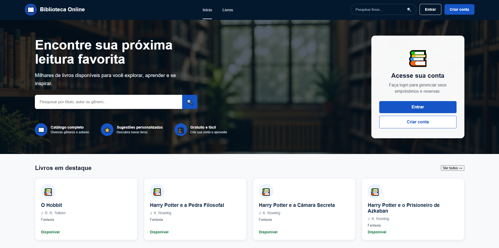
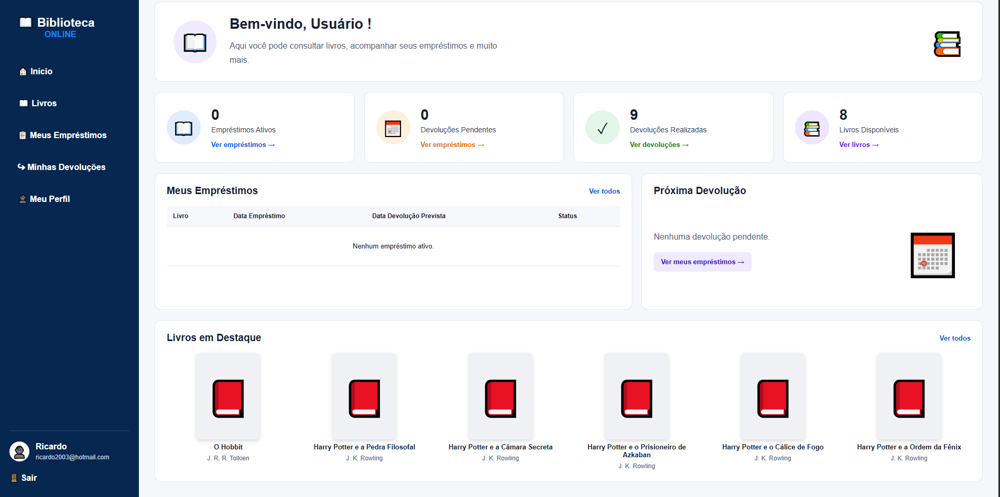
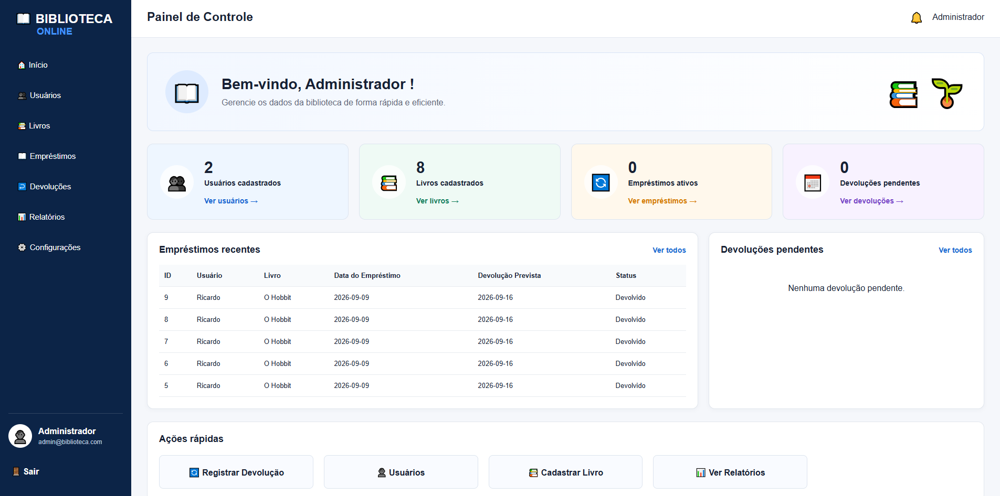

# 📚 Biblioteca Online

Sistema Web para gerenciar uma biblioteca criado com Java e Spring Boot, visando a implementação prática de princípios de desenvolvimento Back-end, APIs REST,, autenticação, armazenamento de dados e ligação com um banco de dados.

A plataforma conta com dois tipos de acesso: Usuário e Administrador, cada um com suas respectivas funções.

## 🌐 Sistema Online

O projeto está disponível e pode ser acessado em:

https://biblioteca-online-spring-boot.onrender.com

> Este projeto utiliza o plano gratuito do Render. Assim, a primeira vez que se acessa pode demorar alguns segundos até que o servidor comece a funcionar.

## 🚀 Tecnologias empregadas

Back-end

- Java
- Spring Boot
- Spring MVC
- Spring Data JPA
- Spring Security
- Hibernate
- Maven

Front-end

- HTML5
- CSS3
- JavaScript

Banco de dados

- PostgreSQL

Deploy

- Render
- Docker

Versionamento

- Git
- GitHub
## ⚙️ Recursos

👤 Usuário

- Cadastro e autenticação de usuários
- Acesso ao catálogo de livros
- Busca de livros por título, autor ou gênero
- Verificação da disponibilidade dos livros
- Reserva de livros
- Acompanhamento dos empréstimos
- Retorno de livros
- Histórico  de devoluções
- Visualização e alteração do perfil

🛠️ Administrador

- Autenticação com perfil de administrador
- Dashboard administrativo
- Gerenciamento de usuários
- Cadastro e administração de livros
- Controle de estoque dos títulos
- Acompanhamento  dos empréstimos
- Acompanhamento das devoluções
- Criação e visualização de relatórios
- Configurações do sistema

## 🏗️ Estrutura do Back-end

A estrutura do Back-end foi elaborada com uma arquitetura em camadas, dividindo as funções da aplicação.

### Controller

Tem a função de receber as solicitações HTTP e disponibilizar os endpoints da aplicação

### Service
Fica encarregado das normas de negócio e do gerenciamento das operações do sistema.

### Repository

Responsável pela interação com o banco de dados através do uso do Spring Data JPA.

### Model

Tem a responsabilidade de representar as entidades do sistema e de fazer o mapeamento das tabelas por meio do JPA.

### DTO

Utilizado para transferir informações entre diversas partes da aplicação.

### Security

É responsável pela autenticação, verificação de permissões e gerenciamento de acesso aos recursos do sistema utilizando o Spring Security.

Fluxo principal da aplicação:

`Controller → Service → Repository → Banco de Dados`

## 🗄️ Banco de Dados

O sistema faz uso do **PostgreSQL** em sua operação, com a persistência dos dados efetuada por meio do Spring Data JPA e do Hibernate.

As principais entidades presentes no sistema incluem:

- **Usuário**— mantém os registros dos usuários e administradores do sistema.
- **Livro** — guarda informações sobre os livros e monitora sua disponibilidade.
- **Empréstimo** — anota os empréstimos efetuados, interligando usuário e livro.
- **Configuração** do Sistema — conserva as configurações aplicadas pela biblioteca.

Relacionamentos

A entidade Empréstimo estabelece relações com:

`Usuário → Empréstimo ← Livro`

Cada empréstimo documenta qual usuário executou a operação, qual livro foi retirado, as datas relacionadas ao empréstimo e seu estado.

O banco de dados na produção está hospedado no Render PostgreSQL.

## 🔐 Segurança e Autenticação

O sistema faz uso do Spring Security para gerenciar a autenticação e a permissão dos usuários.

As senhas são guardadas de maneira segura com a utilização de **BCrypt**, evitando que sejam armazenadas em forma legível.

O sistema opera com dois tipos de acesso:

- **USUARIO** — permite o uso de funcionalidades da biblioteca, como catálogo, reservas, empréstimos, devoluções e gestão de perfil.
- **ADMIN** — possibilita o uso de funcionalidades administrativas, incluindo a gestão de usuários, livros, empréstimos, devoluções, relatórios e configurações.

As rotas têm proteção baseada no perfil do usuário autenticado, evitando que usuários regulares acessem recursos que são exclusivos para a administração.

Controle de acesso

Exemplos de áreas com proteção:

`/usuario/ → ROLE_USUARIO`

`/admin/ → ROLE_ADMIN`

A autenticação é feita com o uso de e-mail e senha, e uma vez logado, o usuário é levado à seção que corresponde ao seu perfil.

## ☁️ Deploy e Infraestrutura

O software está hospedado no **Render** e utiliza **Docker** para sua construção e operação no ambiente de produção.

O banco de dados utilizado na produção é o **PostgreSQL**, também armazenado no Render.

As credenciais e os detalhes de conexão com o banco de dados são geridos por variáveis de ambiente, prevenindo que informações confidenciais fiquem diretamente no código-fonte.

## Ambiente de Produção

- Serviço: Render Web Service
- Banco de dados: PostgreSQL
- Containerização: Docker
- Controle de versão: Git e GitHub
- Construção: Maven

O acesso à aplicação pode ser feito em:

https://biblioteca-online-spring-boot.onrender.com

> O serviço está operando com o plano gratuito do Render. Portanto, o primeiro acesso pode demorar alguns instantes enquanto a aplicação é carregada.

## 💻 Instruções para Executar o Projeto

## Pré-Requisitos

Para rodar o projeto localmente, é necessário ter:

- Java
- Maven
- PostgreSQL ou outro banco de dados configurado para o ambiente
- Git

## 1. Fazer o clone do repositório

```bash
git clone https://github.com/JonathanMour/biblioteca-online-spring-boot.git
```
### 2. Acessar o projeto

```bash
cd biblioteca-online-spring-boot
```
A aplicação faz uso das seguintes variáveis de ambiente:
```text
DB_URL
DB_USERNAME
DB_PASSWORD
```
Exemplo de configuração:

```text
DB_URL=jdbc:postgresql://localhost:5432/biblioteca
DB_USERNAME=seu_usuario
DB_PASSWORD=sua_senha
```
> Nunca publique credenciais reais do banco de dados no repositório.

### 4. Executar a aplicação

No Windows:

```bash
mvnw.cmd spring-boot:run
```

No Linux/macOS:

```bash
./mvnw spring-boot:run
```

Após iniciar a aplicação, acesse:

```text
http://localhost:8080
```
## 📸 Capturas de Tela

### Página Inicial

### Área do Usuário



### Painel Administrativo



## 📚 Principais Aprendizados

Durante o desenvolvimento deste projeto foram aplicados conceitos como:

- Java e Spring Boot
- APIs REST
- Arquitetura em camadas
- Programação Orientada a Objetos
- Spring Data JPA
- PostgreSQL
- Spring Security
- BCrypt
- HTML, CSS e JavaScript
- Git e GitHub
- Docker
- Deploy no Render

## 👨‍💻 Autor

**Jonathan Moura**

Estudante de Engenharia de Software voltado para desenvolvimento Back-end em Java.
### GitHub

https://github.com/JonathanMour